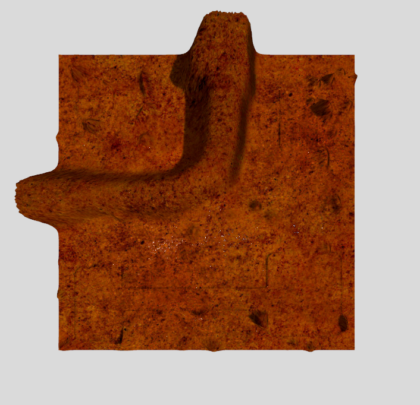

# Мир Scene


## Описание 

Мир подражает специфическому марсианскому дизайну. Мир состоит из нескольких моделей.

* `ground` &mdash; основа мира. Площадка создана на основе карты высот `heightmap.png` (8-битное изображение в градации серого) с текстурой `texture.jpg`. `heightmap.xcf` &mdash; файл проекта модели земли в графическом редакторе `GIMP`. 

## Запуск

Для запуска мира в симуляторе Gazebo требуется перейти в папку мира:

```sh
cd scene
```
и запустить симулятор командой:
```sh
gz sim scene.world
```
